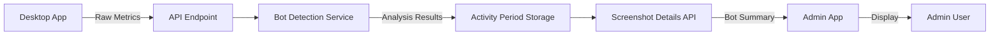

# Bot Detection Architecture - Backend Processing

## Overview
Bot detection has been moved from the desktop application to the backend API to maintain separation of concerns. The desktop app now focuses on its core functionality of data collection, while the backend handles all analysis and detection logic.

## Architecture Changes

### 1. Desktop Application (Data Collection Only)
**File**: `apps/desktop/src/main/services/metricsCollector.ts`

The desktop app now:
- Collects raw metrics without analysis
- Sends unprocessed data to the backend:
  - `keystrokeCodes`: Array of actual key codes pressed
  - `keystrokeTimestamps`: Array of timestamps for each keystroke
  - `mousePositions`: Array of {x, y, timestamp} for mouse movements
  - `clickTimestamps`: Array of click event times
  - `scrollTimestamps`: Array of scroll event times
- Always sends `botDetection` with neutral values (false/0)

```typescript
// Desktop sends raw data
const metrics = {
  keyboard: {
    totalKeystrokes: 100,
    uniqueKeys: 5,
    productiveKeystrokes: 80,
    keystrokeCodes: [65, 66, 67, ...],  // Raw key codes
    keystrokeTimestamps: [1234567890, ...]  // Raw timestamps
  },
  mouse: {
    totalClicks: 20,
    totalScrolls: 10,
    distancePixels: 500,
    mousePositions: [{x: 100, y: 200, timestamp: 1234567890}, ...],
    clickTimestamps: [...],
    scrollTimestamps: [...]
  },
  botDetection: {
    keyboardBotDetected: false,  // Always false - backend determines
    mouseBotDetected: false,      // Always false - backend determines
    confidence: 0,
    details: []
  }
}
```

### 2. Backend API (Analysis & Detection)
**Files**:
- `apps/api/src/modules/activity/bot-detection.service.ts` - Core detection logic
- `apps/api/src/modules/activity/activity.service.ts` - Integrates bot detection
- `apps/api/src/modules/screenshots/screenshots.service.ts` - Aggregates bot detection data

The backend:
- Receives raw metrics from desktop
- Analyzes patterns using enhanced algorithms:
  - `analyzeKeystrokeSequences()` - Detects repetitive key patterns
  - `analyzeTimingPatterns()` - Identifies unnatural timing consistency
  - `analyzeMouseMovementPatterns()` - Finds perfect angles and straight lines
- Stores detection results in activity period metrics
- Provides bot detection summary for screenshots

#### Detection Algorithms

**Keyboard Bot Detection**:
- Extremely limited key variety (≤2 unique keys in 20+ keystrokes)
- Unnaturally consistent typing rhythm (std deviation < 10ms)
- 100% productive keystrokes (unusual for human typing)
- Repetitive sequences (10+ repetitions of 30-key sequences)
- Filters out presentation navigation (arrow keys, space, enter)

**Mouse Bot Detection**:
- Extremely slow smooth movement (≤3 px/s) - PyAutoGUI signature
- Perfect angles (>80% movements at 45° or 90°)
- Mostly straight line movements (>90%)
- Many clicks with minimal movement
- Activity with zero mouse movement

### 3. Admin Application (Display Only)
**File**: `apps/admin/src/components/ScreenshotGrid.tsx`

The admin app:
- Fetches bot detection results from backend
- Displays warnings when bot activity is detected
- Shows detection confidence and reasons (for admin users only)
- Aggregates bot detection across activity periods

## Data Flow



1. **Desktop Collection**: Captures raw user activity (keystrokes, mouse movements)
2. **API Reception**: `/activity-periods` endpoint receives raw metrics
3. **Backend Analysis**: `BotDetectionService` analyzes patterns
4. **Storage**: Results stored in `activity_periods.metrics.botDetection`
5. **Aggregation**: Screenshot details include bot detection summary
6. **Admin Display**: Shows alerts and details for flagged activity

## Benefits of Backend Processing

1. **Separation of Concerns**:
   - Desktop app focuses on data collection
   - Backend handles all business logic
   - Easier to maintain and update

2. **Centralized Updates**:
   - Detection algorithms can be updated without desktop app releases
   - All users immediately benefit from improvements
   - No version fragmentation

3. **Better Security**:
   - Detection logic is not exposed in client code
   - Harder for malicious users to bypass
   - Audit trails on the server side

4. **Performance**:
   - Reduces processing load on user's machine
   - Backend can use more sophisticated algorithms
   - Can leverage server resources for analysis

5. **Consistency**:
   - All detection uses the same logic
   - No variations between different desktop app versions
   - Uniform thresholds and rules

## Configuration & Thresholds

Current thresholds (defined in backend):
- **Detection Confidence**: 0.7 (70%) triggers bot flag
- **Angle Dominance**: >80% perfect angles (raised from 60% to reduce false positives)
- **Typing Consistency**: <10ms std deviation for 50+ keystrokes
- **Movement Speed**: ≤3 px/s considered bot-like
- **Key Variety**: ≤2 unique keys in 20+ keystrokes

## Testing

To verify the implementation:

1. **Check Desktop Metrics**:
   ```javascript
   // In browser console (DevTools)
   // Look for activity-periods POST requests
   // Verify payload contains raw arrays:
   - keystrokeCodes
   - keystrokeTimestamps
   - mousePositions
   ```

2. **Backend Logs**:
   ```bash
   # Check API logs for bot detection
   grep "Bot activity detected" api.log
   ```

3. **Admin Interface**:
   - Navigate to Screenshots view
   - Look for orange bot detection warnings
   - Click on flagged screenshots to see details

## Migration Notes

- Desktop app version 1.1.0+ sends raw metrics
- Backend processes all bot detection
- Older desktop versions still work (send pre-analyzed data)
- Admin app automatically displays backend results

## Future Enhancements

1. **Machine Learning Integration**:
   - Train models on confirmed bot/human patterns
   - Adaptive thresholds based on user behavior
   - Anomaly detection for new bot patterns

2. **Real-time Alerts**:
   - WebSocket notifications for bot detection
   - Immediate admin notifications
   - Auto-suspend suspicious sessions

3. **Advanced Analytics**:
   - Bot pattern trends over time
   - Organization-wide bot detection stats
   - Comparative analysis across users

4. **User Feedback Loop**:
   - Allow admins to mark false positives
   - Adjust thresholds based on feedback
   - Improve detection accuracy over time